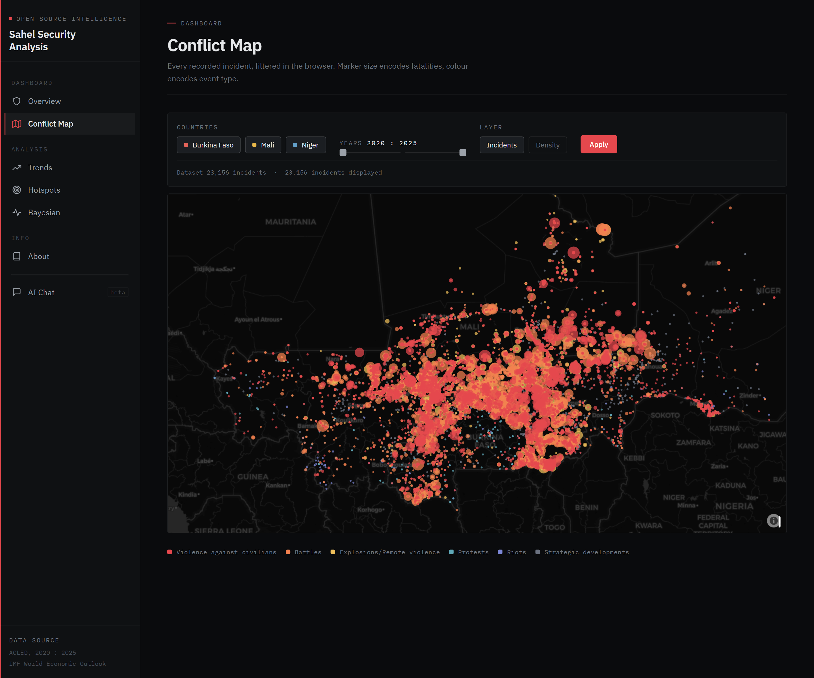
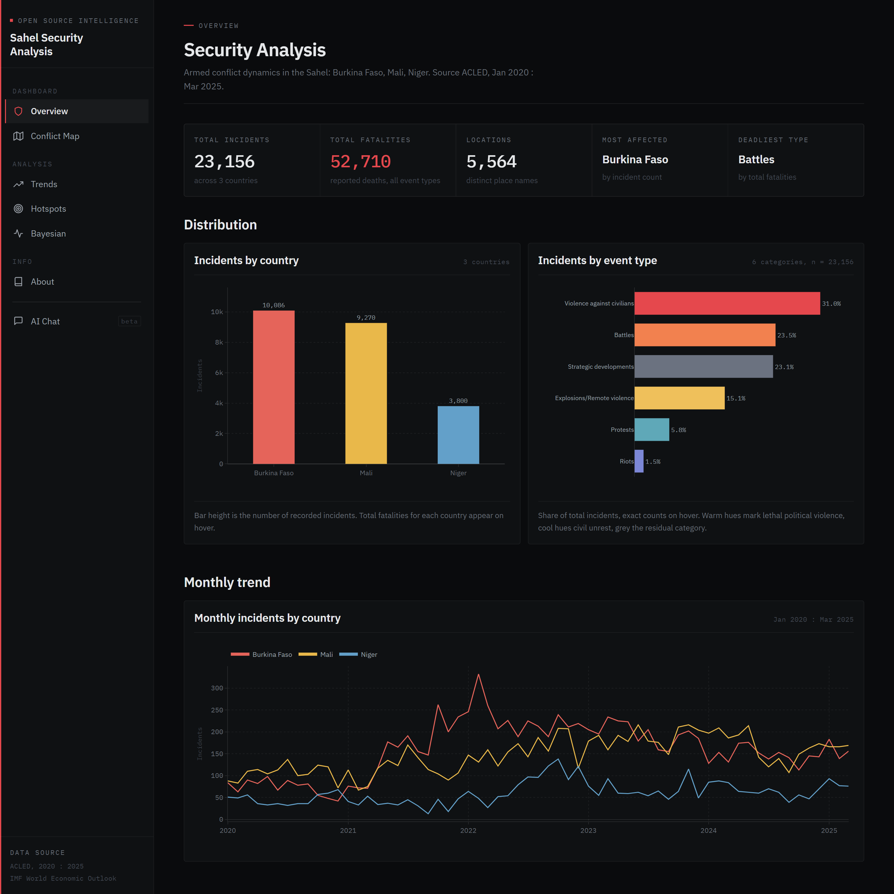
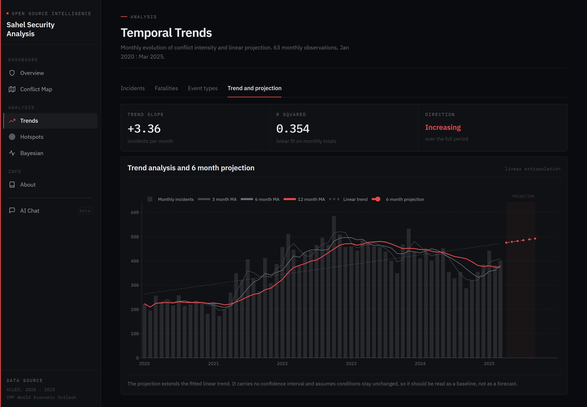
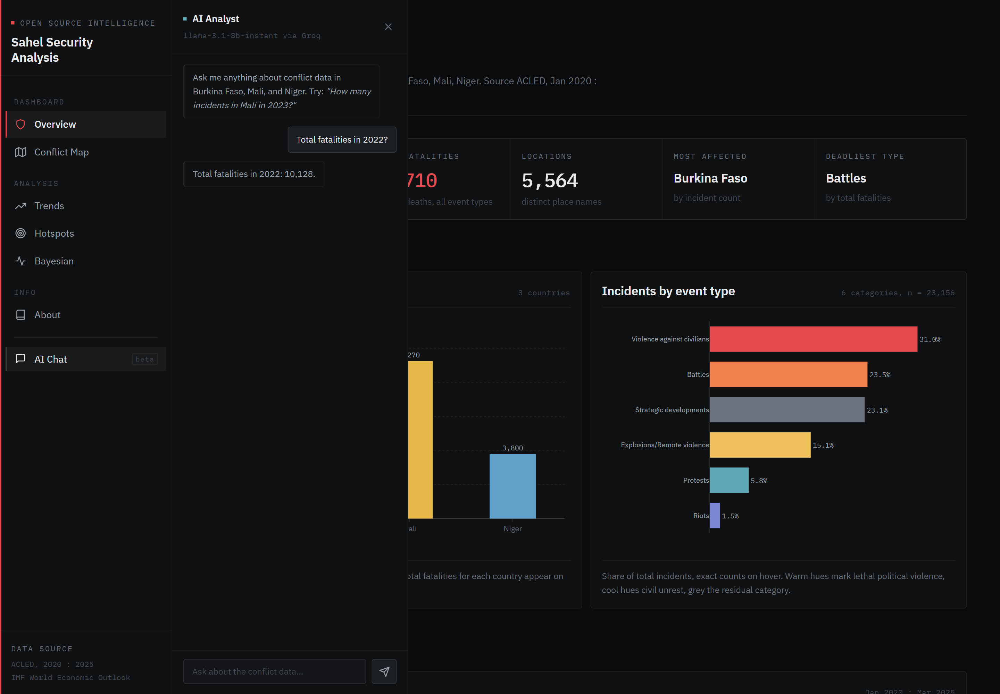

# Sahel Security Analysis

An open-source intelligence platform analyzing armed conflict dynamics and their economic consequences in Burkina Faso, Mali, and Niger, built on ACLED data, Bayesian modeling, and a RAG-powered AI analyst.

**Live demo:** [sahel-security-analysis.onrender.com](https://sahel-security-analysis.onrender.com/)
First load takes 30 to 60 seconds: the free Render instance spins down when idle.

---



*23,156 ACLED incidents rendered with Plotly WebGL. Marker size encodes fatalities,
colour encodes event type, filtering runs entirely in the browser.*

---

## What it does

- Visualizes 23,000+ conflict incidents on an interactive WebGL map with real-time client-side filtering
- Tracks monthly trends, detects anomalies (Z-score), and projects a 6-month forecast via linear regression
- Identifies geographic hotspots and most active armed groups
- Quantifies the conflict-inflation relationship through a Bayesian hierarchical model (PyMC, ArviZ)
- Exposes an AI analyst powered by a RAG pipeline: answers are constrained to context retrieved from the ACLED dataset



*Key metrics, distribution by country and by event type, monthly trend.*



*Rolling averages, fitted linear trend and a 6-month baseline projection.*



*Questions answered from context retrieved in the ACLED DataFrame with Pandas,
then passed to Llama 3.1 through Groq.*

---

## Versions

| Branch | Stack | Status |
|---|---|---|
| `main` | Flask, Plotly WebGL, RAG chatbot, Render | Live |
| `streamlit` | Streamlit, Folium | Preserved |

The project was originally built with Streamlit. It was migrated to Flask to support a production deployment with a RAG chatbot, WebGL map performance at 23k points, and full control over the frontend design.

---

## Architecture

```
flask_app/
├── routes/          # Page blueprints (overview, map, trends, hotspots, bayesian, about)
├── api/             # JSON endpoints (map points, chart data, chat)
├── chat/
│   ├── rag.py             # Intent detection + Pandas retrieval + prompt builder
│   ├── backend_local.py   # Gemma via Ollama (local Docker)
│   └── backend_groq.py    # Llama 3.1 via Groq API (production)
├── utils/
│   └── data_loader.py     # lru_cache data loading
├── theme.py         # Design system: colour palettes + global Plotly template
├── static/css/      # Design tokens and components (no CSS framework)
└── templates/       # Jinja2 templates extending base.html
```

---

## RAG chatbot

The AI analyst uses a two-stage pipeline:

1. **Retrieval:** intent detection extracts countries, years, and event types from the question, then queries the ACLED DataFrame with Pandas to build structured context (incident counts, fatalities, top actors, yearly trend).
2. **Generation:** the context is injected into a system prompt sent to the LLM. The model answers strictly from the retrieved data.

**Local setup:** Gemma via Ollama, containerized with Docker Compose.
**Production:** switched to Groq API (Llama 3.1 8B) after identifying that Ollama containers require 8GB+ RAM, exceeding free-tier cloud limits.

---

## Tech stack

| Layer | Tools |
|---|---|
| Backend | Flask 3, Gunicorn, flask-compress |
| Data | Pandas, NumPy |
| Visualization | Plotly (WebGL, 23k points without lag) |
| Bayesian model | PyMC 5, ArviZ |
| AI / RAG | Groq API (prod), Ollama + Gemma (local) |
| Deployment | Render, Docker Compose |
| Data source | ACLED API (OAuth2), IMF DataMapper API |

---

## Quickstart

### Flask app (local)

```bash
python -m venv .venv
source .venv/bin/activate   # macOS, Linux
pip install -r requirements.txt
cp .env.example .env        # fill GROQ_API_KEY or set CHAT_BACKEND=local
python run.py
```

On Windows (PowerShell):

```powershell
python -m venv .venv
.venv\Scripts\Activate.ps1
pip install -r requirements.txt
Copy-Item .env.example .env
python run.py
```

App available at `http://localhost:5000`.

### With local AI (Gemma via Ollama)

```bash
# Install Ollama: https://ollama.com/download
ollama pull gemma2:2b
```

Set in `.env`:

```
CHAT_BACKEND=local
OLLAMA_HOST=http://localhost:11434
OLLAMA_MODEL=gemma2:2b
```

Then run `python run.py`.

### Full Docker setup (Flask + Ollama)

```bash
docker-compose up --build
```

Ollama pulls the model on first start. `depends_on` only waits for the Ollama
container to start, not for the pull to finish, so the chat returns an error
until the model is downloaded (a few minutes on first run).

---

## Bayesian model

We fit a Bayesian hierarchical linear regression to test whether conflict intensity (ACLED) predicts national inflation (IMF):

```
inflation(t) = α_country + β x conflict_z(t-1) + ε

Priors:
  α_country ~ Normal(μ_α, σ_α)   # country-specific intercept
  β         ~ Normal(0, 2)        # shared conflict effect
  σ         ~ HalfNormal(5)
```

**Result:** β = -0.416, 94% HDI [-2.302, +1.399]. The HDI includes zero: no credible causal effect can be established at the country-year aggregation level. This null result is methodologically expected given N=12 and the mismatch between local conflict dynamics and national CPI.

Sampled with NUTS, 4 chains x 4,000 draws, all R-hat = 1.0.

---

## Data

| Source | Coverage | Access |
|---|---|---|
| ACLED | 23,156 incidents, Jan 2020 to Mar 2025 | OAuth2 API |
| IMF DataMapper | Annual CPI, 2018 to 2024 | Public API |

---

## Project structure

```
sahel-security-analysis/
├── flask_app/          # Flask application
├── app/                # Streamlit version (branch: streamlit)
├── data/processed/     # Preprocessed CSV files (tracked in git)
├── notebooks/          # Analysis notebooks (EDA, Bayesian model)
├── src/                # ACLED data pipeline
├── docker-compose.yml  # Local Docker setup (Flask + Ollama)
├── Dockerfile
├── render.yaml         # Render deployment config
├── run.py
└── requirements.txt
```

---

## Author

Ousaïrou Bagagnan, Data Science Student
